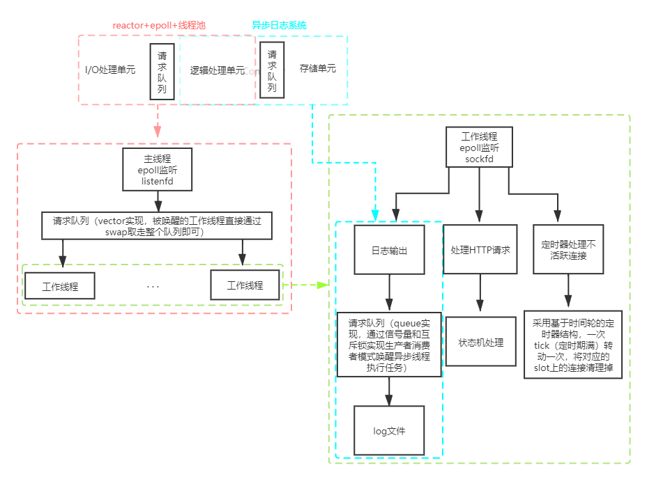

## 基于Linux的轻量级Web服务器
本项目是Linux下的轻量级的Web服务器项目，主要采用C++语言，通过完成该项目，让自己更加熟悉C++编程及系统编程

 - 使用**线程池 + epoll(ET) + Reactor模式**的并发模型
 
 - 使用**状态机**解析HTTP请求报文，支持解析GET和POST请求
  
 - 使用**时间轮**结构管理定时器，定时清理不活跃的连接
   
 - 实现**同步/异步日志系统**，记录服务器运行状态

 - 经Webbench压力测试可以实现**高并发**连接数据交换

## 目录
## 框架

## 压力测试

 - 关闭服务器日志功能情况下，采用webbench进行压力测试
 - 并发连接数：10000
 - 访问服务器时间：5s
 - 测试结果：所有连接均成功
 - 截图！
## 运行
 - 服务器环境：ubuntu
 - 浏览器环境：均可 		
 - ip:9090
 - 编译：g++ main.cpp ./WebServer/WebServer.cpp ./ThreadPool/ThreadPool.cpp ./TimerWheel/TimerWheel.cpp ./Log/Log.cpp ./Http/http_conn.cpp -o server -pthread -std=c++11
 - 运行：./server
 - todo：尚未编写MakeFile及将port等作为参数传入

## 致谢与展望

 - 《Linux高性能服务器编程》--游双
 - https://github.com/qinguoyi/TinyWebServer
 - https://github.com/linyacool/WebServer
